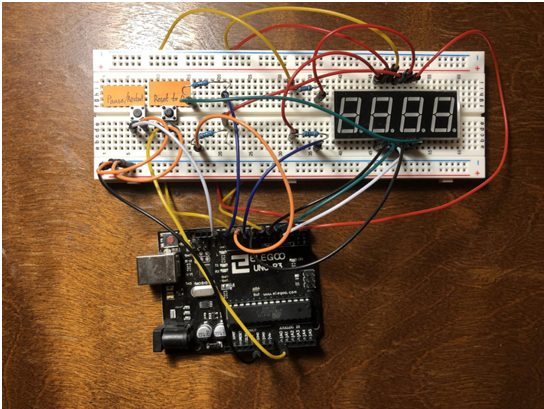

# Stopwatch

## Introduction
A Stopwatch created by using Arduino UNO Rev3. The functions of this project include a timer that would count up with seconds and minutes, display the correct time with the four digit seven segment, reset the timer, pause and restart the timer.

## Demonstration

Demonstration video link: https://youtu.be/u0hclShrEls
 
## Timer Pause Algorithm
In the Arduino loop, it will check if the pause button is pressed or not, based on the previous state of the pause button state and the current pause button state. It will decide either pause the timer or keep the timer going.

## Parts List
- 1x	Arduino UNO Rev3

- 1x	Breadboard

- 1x	4 digit 7 segment

- 2x	Button

- 4x	220V Resistor

- 21x	Wire

## Referneces:

- Baldengineer. (2015, August 11). Arduino: How do you reset millis()? Retrieved from https://www.baldengineer.com/arduino-how-do-you-reset-millis.html

- SAnwandter1. (2018, August 31). Programming 4 Digit 7 Segment LED Display. Retrieved from https://www.hackster.io/SAnwandter1/programming-4-digit-7-segment-led-display-2d33f8

- Instructables. (2017, October 06). Using a 4 Digit, 7 Segment Display, With Arduino. Retrieved from https://www.instructables.com/id/Using-a-4-digit-7-segment-display-with-arduino/
